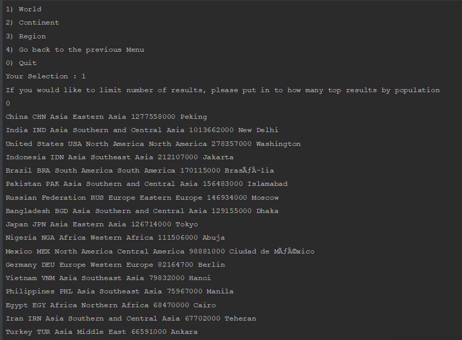
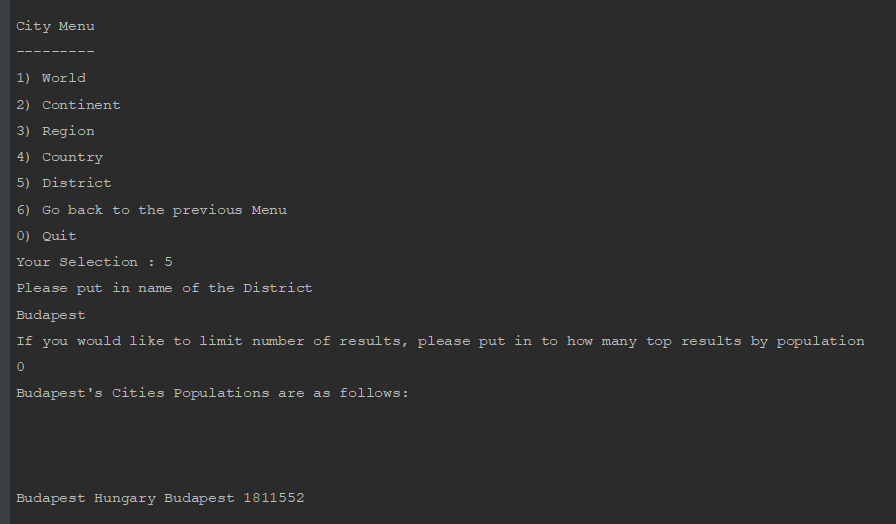

# Software Engineering Methods

- Master Build Status   

- Develop Build Status  

- License   

- Release   

**Build on master is failing because lack of google cloud credits.**

**32 requirements of 32 have been implemented, which is 100%.**

| ID  | Name  |  Met |  Image |
|---|---|---|:-:|
| 1 | All the countries in the world organised by largest population to smallest.  |  Yes |   |
| 2 | All the countries in a continent organised by largest population to smallest.  |  Yes |   |
| 3 | All the countries in a region organised by largest population to smallest. |  Yes |   |
| 4 | The top N populated countries in the world where N is provided by the user. |  Yes |   |
| 5 | The top N populated countries in a continent where N is provided by the user.  |  Yes |   |
| 6 | The top N populated countries in a region where N is provided by the user. |  Yes |   |
| 7 | All the cities in the world organised by largest population to smallest.  |  Yes |   |
| 8 | All the cities in a continent organised by largest population to smallest. |  Yes |   |
| 9 | All the cities in a region organised by largest population to smallest.  |  Yes |   |
| 10 | All the cities in a country organised by largest population to smallest.  | Yes |   |
| 11 | All the cities in a district organised by largest population to smallest.  | Yes |   |
| 12 | The top N populated cities in the world where N is provided by the user.  | Yes |   |
| 13 | The top N populated cities in a continent where N is provided by the user.  | Yes |   |
| 14 | The top N populated cities in a region where N is provided by the user.  | Yes |   |
| 15 | The top N populated cities in a country where N is provided by the user.  | Yes |   |
| 16 | The top N populated cities in a district where N is provided by the user.  | Yes |   |
| 17 | All the capital cities in the world organised by largest population to smallest.  | Yes |   |
| 18 | All the capital cities in a continent organised by largest population to smallest.  | Yes |   |
| 19 | All the capital cities in a region organised by largest to smallest.  | Yes |   |
| 20 | The top N populated capital cities in the world where N is provided by the user.  | Yes |   |
| 21 | The top N populated capital cities in a continent where N is provided by the user.  | Yes |   |
| 22 | The top N populated capital cities in a region where N is provided by the user.  | Yes |   |
| 23 | The population of people, people living in cities, and people not living in cities in each continent.  | Yes | .") |
| 24 | The population of people, people living in cities, and people not living in cities in each region.  | Yes | .") |
| 25 | The population of people, people living in cities, and people not living in cities in each country.  | Yes | .") |
| 26 | The population of the world.  | Yes |   |
| 27 | The population of a continent.  | Yes | .")  |
| 28 | The population of a region.  | Yes | .")  |
| 29 | The population of a country.  | Yes | .")  |
| 30 | The population of a district.  | Yes |   |
| 31 | The population of a city.  | Yes |   |
| 32 | The number of people who speak a certain language(Language Report) | Yes | ")  |